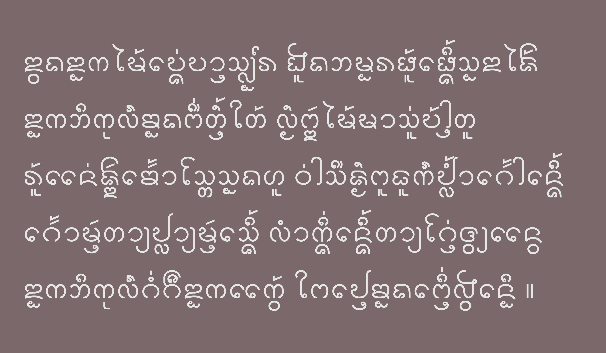
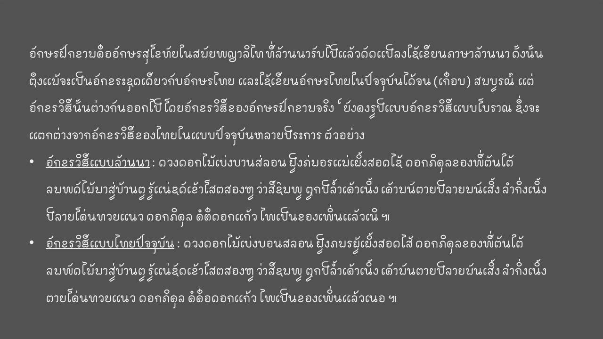

# The Lanna font project

Hi there, my name is Norraseth, from Northern Thailand. Personally, developing a font for tai tham script has been my hobby scine 2017. So, yes, hobby means I am really an amateur in this 'font' and 'coding' thing. But at the end of the day, I can achieve to produce 2 fonts for 2 scripts (each).
Still not so perfect, but I think it's a good start to publish them in github (as my friend suggested). I would be greatful if the real expert could help improving these scripts (especially on the opentype feature)

## Tai Tham Lanna script
Tai tham Lanna script is the script of Lanna language used in nowadays Northern Thailand, which, of course, my real native language. Here, I try to develop a unicode font for tai tham script with modern Lanna aesthetics. I choose the monoline sans serif style becuase it's simple and legible. The problems that lead to my creation of this font are:
1. The current fonts widely used for tai tham script is in a serif or traditional style which is beautiful but very difficult for reading on screen and print. 
2. Very few sans serif font for tai tham script with Lanna aesthetics.
3. Very few unicode fonts for tai tham script.

Well, as a native of this language and the script, I feel obliged a bit to preserve this script. But my goal is also to merge this script with the modern word technology and also aesthetics. That's why I choose to make them in sans serif form, hoping to be legible on screen and print while still preserving the feature and aesthetic of Lanna. The first version of the font itself had been fully developed since late 2017 but hasn't been published becuase I was so busy with my (real) career. Anyway, the font continuously get tested and fixed throughout the years.

I name the font as **"Tahlom"** following the name of an anmaranth flower in Lanna language which has a round shape similar to the shape of the . The world *"Ta-lom"* or *"Tom-lom"* also mean "round" or "spherical" in Lanna langauge.

## Fakkham script
During summer 2018, I also create another ancient script used in Lanna which is called "Fakkham script". I name it **"Somphoa"** following the name of a peacock flower in Lanna langauge.

Fakkham script is the script used alongside with tai tham script in ancient Lanna. 
The script itself is based on Sukhothai version of Thai script. 
Thus, we can say that Fakkahm script is a Lanna version of Thai script.
Whilst being so similar to modern Thai script, spelling system of Fakkham script preserves lots of ancient feature of Thai script.

